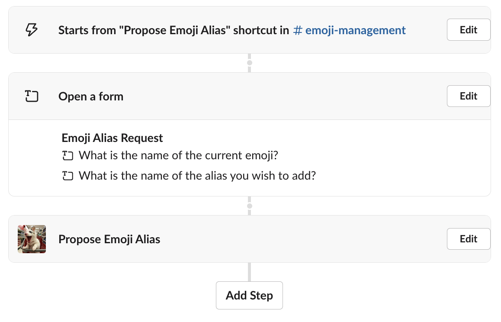
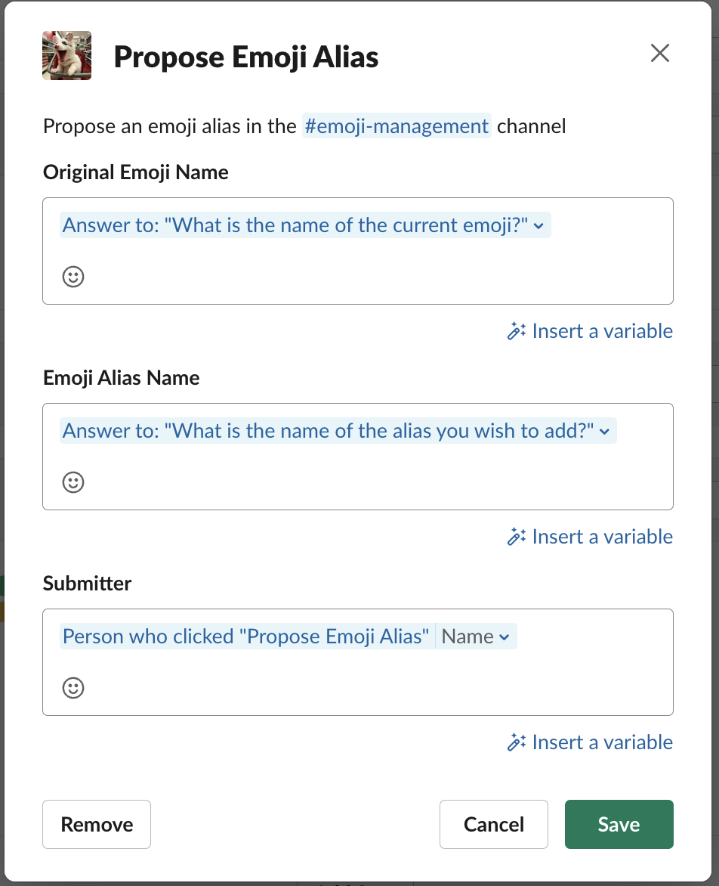
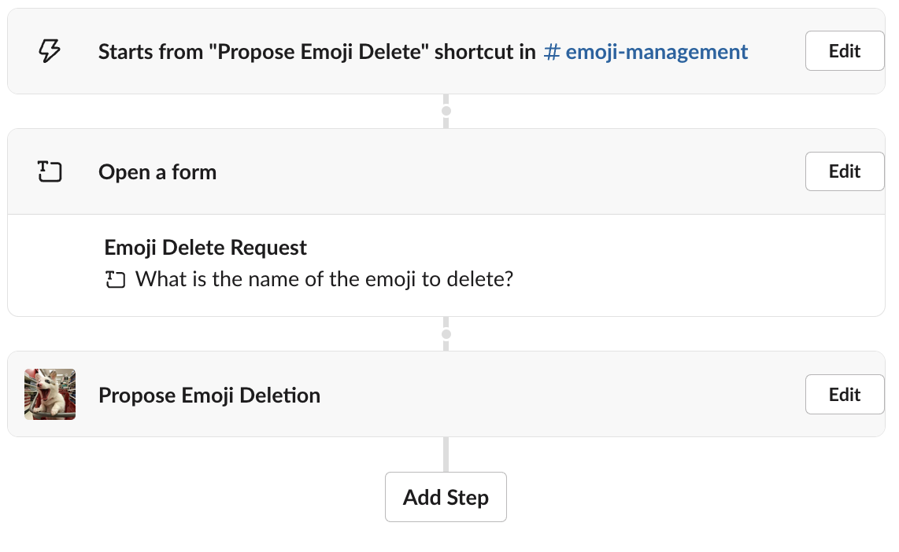
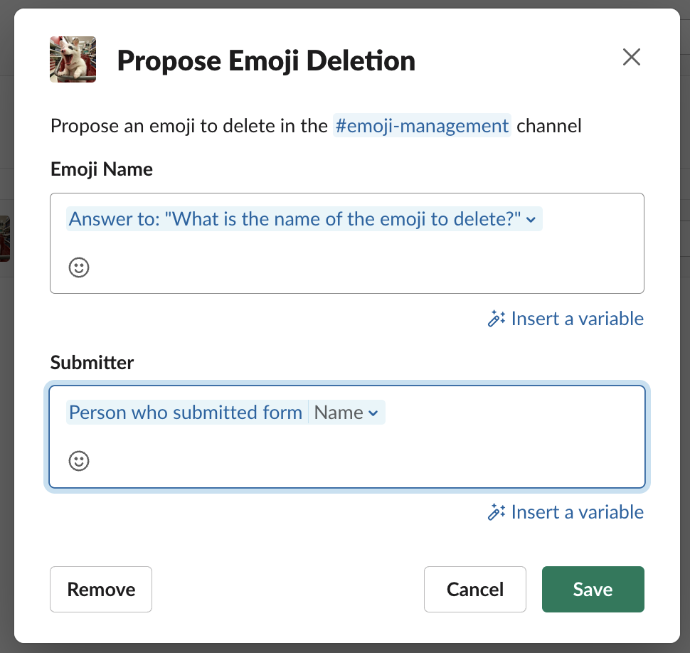

# Emoji Manager Installation

Emoji Manager is a more advanced app that requires special permissions and multiple steps to be installed correctly. This app has only been tested on Enterprise Grid installations, but may work on other tiers as well.

## Slack Configuration

Create a Slack application on https://api.slack.com/apps and select the workspace it will be installed into.
The Slack configuration can be described by the example [manifest.yml](manifest_exampe.yml). Make sure to update the values for your webserver hostname.

## Slack Deployment

The app must be installed as an Admin user, as it uses admin scopes to access the `admin.emoji.add` API endpoint. Installation takes 2 steps

- Install to the Grid organization. You can do this from the https://api.slack.com/apps page for Emoji Manager
- Install to the workspace. You can do this from the Enterprise Grid Management page (https://app.slack.com/manage/[TEAMID]/integrations/installed) and select the workspace to install in.  Because of how `@Emoji Manager` works, only install into a single workspace

Once installed, create a public channel for voting, we suggest `#emoji-management`.  Additionally, create a private channel for the emoji admins to receive notifications in, we suggest `#emoji-admins`. Invite `@Emoji Manager` to both channels.

## Application Configuration

The application can be configured using [Hocon](https://github.com/lightbend/config) and/or Yaml configuration files. You can specify as many configuration files as you need, to allow splitting the file for different environments, secrets management tools, etc. A proposed layout:

`prod.yaml` - Production settings:
```yaml
slack:
  slackEmojiChannel: C123456789
  slackEmojiAdminChannel: C234567890
  slackAdminUsers:
    - U12345678
    - U23456789

server:
  urlPrefix:  "https://myhost.example.com"

votes:
  commentPeriod: 1
  maxDuration: 5
  winBy: 14
  calendarHolidays:
    - "2025-01-01" # New Years (US/IN)
      "2026-01-01" # New Years (US/IN)

      "2025-01-14" # Sankranti (IN)
      "2026-01-14" # Sankranti (IN)

      "2025-03-31" # Eid ul fitr (IN) — subject to moon sighting
      "2026-03-20" # Eid ul fitr (IN) — subject to moon sighting

      "2025-05-26" # Memorial Day (US)
      "2026-05-25" # Memorial Day (US)
    
      "2025-06-19" # Juneteenth (US)
      "2026-06-19" # Juneteenth (US)
      # etc...

text:
  intro: |
    Custom emojis are a community-supported effort in partnership with the admins.
    Any team member in Slack can suggest a new emoji by posting an image file
    _with the suggested emoji name as the file name_ in the emoji management channel <#${slack.slackEmojiChannel}>.
    If it receives ${votes.winBy} more upvotes than downvotes before ${votes.maxDuration} business days, it will be added.
    There is a comment period of ${votes.commentPeriod} business days to ensure everyone has a chance to see the proposal.
    
    You may withdraw your proposal by reacting to the message with :${text.withdraw}: Note that only the original author can do this, and it cannot be undone.
    
    Proposals for aliases and emoji removals can be done with shortcuts in the emoji management channel.
    
    > Subject to admin discretion, must adhere to all <https://corp.example.com/policies|workplace policies>.


```

`prod-secrets.yaml` - Production secrets, supplied by Vault or other secrets management utility:
```yaml
database:
  url: "jdbc:postgresql://dbhost:5432/emojimanager"
  username: "emojimanager"
  password: "somethingsupersecret"

slack:
  slackSigningSecret: "1234567890"
  slackAdminToken: "xoxp-XXXXX"
  slackBotToken: "xoxb-XXXXX"
```


A few notes:

 * Make sure the Slack configuration tokens are correct for your environment.
 * It is recommended that your intro text includes a link to your internal policies, rules, etc.
 * You can embed some other configuration values into your text by using the format `${section.key}`. See the [Hoplite](https://github.com/sksamuel/hoplite) configuration for more details on how it works.

Once you have your configuration files set up, the app will read the environment variable `EMOJI_MANAGER_CONFIG_FILES` for a comma separated list of files to read in.  For example:

`EMOJI_MANAGER_CONFIG_FILES=/prod-secrets.conf,/prod.yaml`

Hoplite configuration uses a first-in-wins order, so the first time a value is seen it will be used.

A default list of holidays covering common US and India holidays is included.

## Supporting Infrastructure

#### Database

Emoji Manager requires a PostgreSQL database to store emoji proposals.  It does store the files as blobs in the database, so plan for space accordingly. By default, database schema creation/migration happens at startup, which requires providing a username and password with sufficient credentials to create and modify tables. If you wish to handle this yourself, you may turn auto migrations off and omit the admin username and password.

#### Ingress Web

Due to how Slack's API works for adding emoji, Emoji Manager must have its service exposed to the Internet.  It is designed to handle proxies, api gateways, or forwarders well, however. When adding an emoji, Emoji Manager will generate a URL in the format of `https://${server.urlPrefix}/_images/${image_id}` to have the Slack servers download from.

Socket-mode can be used for handling Slack events, however the web service will still be referenced for image uploads to Slack.


## Deployment

A `docker-compose.yml` is included as a reference of how this app may be deployed containerized. The app itself is not designed to deployed in a pool as the app schedules itself to tally votes.

## Workflows

Once deployed, two Steps-from-Apps workflow steps are available. It is recommended to set up workflows for adding aliases and deleting emojis in the channel you selected for emoji management. These workflows will look like this:









## Full Configuration Reference

Below are the complete configuration options available, and defaults if any

```yaml
server:
  port: 3000 # TCP port number to listen on, optional
  urlPrefix: https://example.com # URL prefix for publishing links, required
  urlPath: /api/slack_events # URL path to use, optional

database:
  url: #JDBC connection URL. Note: Only Postgres is tested, required
  username: # Username to connect with, required
  password: # Password to connect with, required
  adminUsername: # Username to perform database migrations, required if doing migrations
  adminPassword: # Password to perform database migrations, required if doing migrations
  autoMigrations: true # Auto-perform database schema migrations

vote:
  # Not setting these values means the default values will be used
  commentPeriod: 1 # in business days, optional
  maxDuration: 30 # in business days, optional
  winBy: 5 # the "win by", optional
  downVoteThreshold: 5 # the threshold to notify admin users, optional
  tallySchedule: 30 # in minutes- how often the tally should run, optional
  calendarHolidays: # Array of dates to exclude from business days, optional
    - 2025-01-02 # Must be in YYYY-MM-DD format
    - 2026-01-01 # Look in the source at default.conf to see built-in list
slack:
  slackSigningSecret: 1234567890 # From Slack installation, required
  slackAdminToken:  xoxp-XXXXX # From Slack installation, required
  slackAppToken: xoxa-XXXXX # From Slack installation, optional
  slackBotToken: xoxb-XXXXX # From Slack installation, required
  slackEmojiChannel: C123456789 # Slack Channel ID to conduct voting in, required
  slackEmojiAdminChannel: C234567890 # Slack Channel ID for admin notifications, optional
  slackAdminUsers: # Array if Slack User IDs who can use admin features
    - U12345678
    - U23456789
  slackProposalChannels: # Array of Slack Channel IDs to additionally allow proposals to originate from, optional
    - C23456789
  slackHintChannels: # Array of Slack Channel IDs to provide usage hints, optional. Suggested to include at least $slackEmojiChannel
    - C123456789
text: # These are all optional, to allow local customizations
  intro: # The text to use in several help locations. Suggested you add a link to company policies
  homeAdvanced: # The text on the App Home scren
  help:
    general: # General help usage
    admin: # Help usage only shown to admins
    cmdStatus: # How to use the status command
    cmdAlias: # How to use the alias command
    cmdRemove: # How to use the remove command
    cmdReset: # How to use the reset command
    cmdTally: # How to use the tally command
    cmdFakevote: # How to use the fakevote command

```