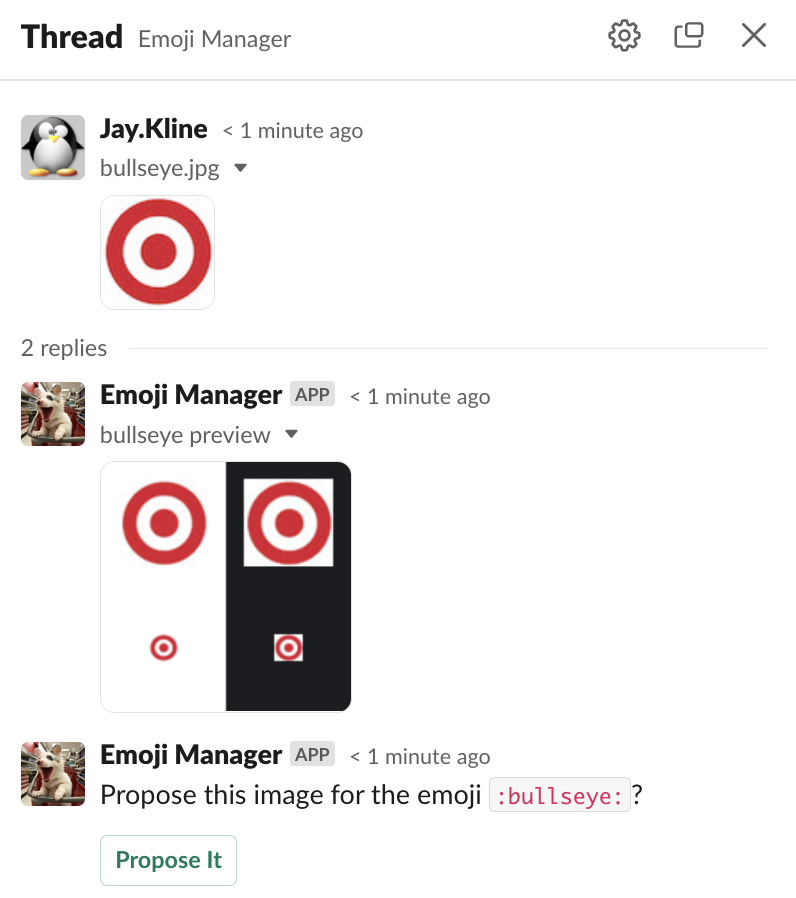
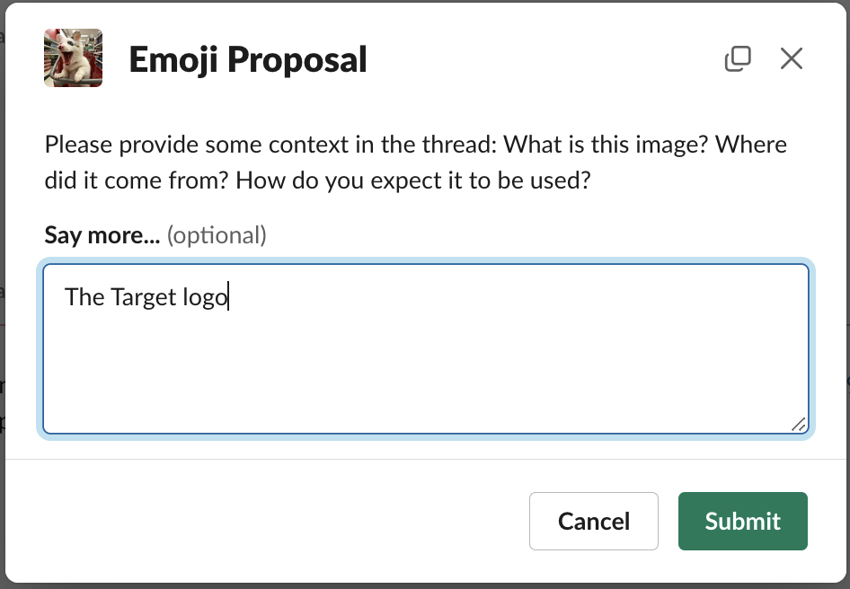
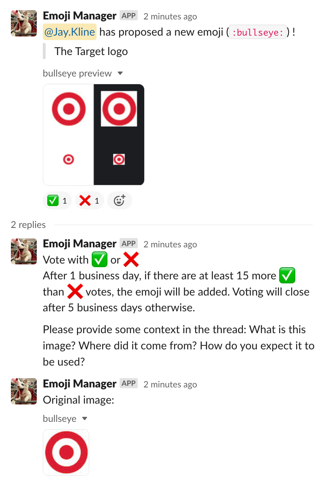

# Emoji Manager Usage

Slack natively provides 2 primary options for setting custom emojis:

 * Allow anyone to upload anything as an emoji
 * Only give a select group (like admins) the ability to upload an emoji

Each of these have some problems, and neither encourage a good community interaction.  We created `@Emoji Manager` to bridge that gap.

`@Emoji Manager` allows any user to _propose_ an emoji, and with community voting automatically upload or reject the proposal. This allows us to keep the rules simple so the community can self-govern.

## How to Use

### New Emoji

To propose a new emoji, simply upload an image with the filename of the emoji you want in a direct message to `@Emoji Manager`.  `@Emoji Manager` will then present you with a preview, and if you are satisfied with the preview, you can click a button to send the proposal to the `#emoji-management` channel for the community to vote on.

Once you click the *Propose It* button, `@Emoji Manager` will ask you for some context about the emoji.  Please provide some information about the image so the voting community knows why your proposal is a good idea.

`@Emoji Manager` will then post the proposal to the `#emoji-management` channel for the community to vote on. Don't forget to vote for your own proposal!

Tips for the best images:

 * Make sure you use an acceptable format (GIF, JPEG, PNG)
 * Keep the size reasonable, ideally 128x128 pixels (it does not need to be square, but square often looks better)
 * Keep the file size small, less than 128KB, or Slack may reject it.
 * Remember users may have light or dark mode enabled, make sure you have good contrast for both
 * Avoid text- emoji are small, and shrunken text is hard to read.

Once you do this, `@Emoji Manager` will do some basic checks and post the voting rules and timeline. Voting is as simple as reacting to the post with a ✅ or ❌ - and don’t forget to vote on your own proposal!

There is an initial comment period of 1 business day where votes are not yet tallied, so that the community has time to weigh in on the proposal. After the comment period, `@Emoji Manager` will check every so often to see if the proposal has enough votes to be accepted. Once it has enough votes (6 more ✅ than ❌), `@Emoji Manager` will automatically upload the new emoji. If the proposal does not get enough votes by the end of the voting period (30 business days), it will close off voting.

If you decide to withdraw your proposal, simply react to the proposal in `#emoji-management` with ⏪ (`:rewind:`) and `@Emoji Manager` will take it out of the running.

Did someone submit an emoji that you think is inappropriate?  You can react with 🔸(`:small_orange_diamond:`) to alert the admins.  
A few notes: 

 * You can only propose one emoji per message.  So don't try to upload 5 images at once- it wont work.  Do them as separate messages.
 * Voting is done with reactions, which means you can only upvote once and downvote once per proposal. You can change your vote as often as you need during the voting period. Yes, you can "cancel" your own vote out, but why even vote then?
 * Admins can force an immediate upload of an emoji, or block an emoji. Sometimes we just need a little extra failsafe.

### Aliases and Deletions

There are times you might want an emoji to be known by more than one name.  Rather than upload a duplicate image for the same name, you can create an alias.  If the original emoji is ever updated, the aliases will reflect the change as well.   To propose an alias, at the top of the channel in the bookmarks bar, select "Propose Emoji Alias" (a Slack Workflow). Do not include colons in your emoji alias input - emoji manager will handle that for you.

Occasionally, removing an emoji makes sense, too. To propose removing an emoji, at the top of the channel in the bookmarks bar, select "Propose Emoji Delete" (a Slack Workflow). Do not include colons in your emoji alias input - emoji manager will handle that for you.

## Advanced Usage

If you want to propose an alias for an emoji, you can use the `/emoji alias` slash command. It’s not too hard, just type the message

`/emoji alias :emoji: :new_alias:`

where `:emoji:` is the existing emoji and `:new_alias:` is the new name you want to add for it. Emoji Manager will create the proposal for you.

Alternatively, you can also use the 'Propose Emoji Alias' workflow in the `#emoji-management` channel. 

If you want to propose the removal of an emoji, you need to use the `/emoji remove` command. Just type the messages

`/emoji remove :emoji:`

where :emoji: is the emoji you wish to remove. `@Emoji Manager` will create the proposal for you.

